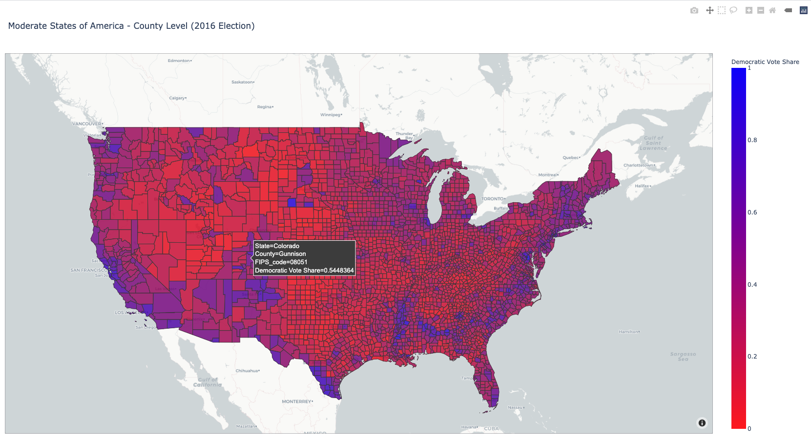

# Moderate States of America

Being a data analyst, I'm always looking for ways to improve visualizations to better understand the numbers and tell a more detailed story. This being an election year, every American spent time looking at colored maps of the Unites States, counting up electoral votes to see who would become our next President. 

Most of these maps categorie our country *only* into [red states and blue states](https://i.insider.com/5fa1eb001df1d50018218b7e?width=1108&format=jpeg), but I believe that instead of this broad brush technique, its worth looking at our the US at a more granular, county level.

Below is a still screenshot of my county by county vizualization.

*Interactive HTML file is at the end of README!*

## Data Wrangling

I got my data from the [MIT Election Lab](https://electionlab.mit.edu/data). **Since COVID-19 has slowed down this year's 2020 Presidential Election and the data isn't finalized yet, I worked with 2016 Presidential Election data.**

The data has election results county by county, listing the FIPS code (unique code to identify any county in the US), state name, number of Hillary Clinton votes, number of Donald Trump votes, and number of 'other' votes (Third party candidates or write-ins).

I added columns for Democratic percentage, Republican percentage, and Other percentage, to better suit the colorscale on my plot (below).

## Plotting Data on Choropleth Map

A **choropleth** is a color coded map, used to visualize data in certain geographic locations. I used [Plotly](https://plotly.com/) to make this map, since it was able to plot colors county by county (based on the above-mentioned FIPS code). Plotly also has interactive visualizations and great looking maps, both features I personally love. In addition, I wanted to learn how to work with another Python plotting library, since most of my previous work has been done with [MatPlotLib](https://matplotlib.org/). 

## Visualization

Clone or download this GitHub repo and go to `interactive_map/county_level_results.html` to check out the interactive plot!

## Interpretation

Whether you lean left like me or right like some of my family members, every one can agree on the fact that broad-ly brushing each state into being blue or red is not the best way to understand our country. There are many liberals in conservative states, as there are conservatives in liberal states. Many of these blue-red divisions are more clearly see at the county level, since those in the same county tend to have similar views, while those in different parts of the same state might not.

**I think being able to see the intricacies in our politics, shades of purple like the map, instead of just the polarities, blue or red, is a great first step to healing the divisions the last few elections have caused.**

## Next Steps

Steps I would take to further this project would be to indicate the populations of each county, since coastal urban counties are much more populated than rural counties, and it would be good practice to show that visually.
